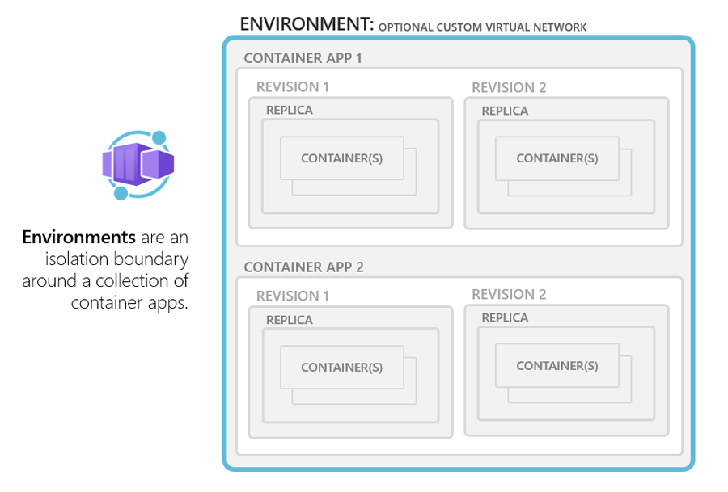

# Azure Container Apps environments

Poszczególne kontenery są wdrażane w  dedykowanej instancji środowiska (**ENVIRONMENT**) Container Apps, które działa jako przestrzeń dla grup aplikacji w kontenerach. Aplikacje kontenerowe w tym samym środowisku są wdrażane w tej samej sieci wirtualnej i zapisują logi w tej samej przestrzeni roboczej Log Analytics. Podczas tworzenia środowiska można podłączyć własną sieć wirtualną (Bring Your Own Network).



## 01. Przytogotwanie ustawień

W pliku `.env` znajdują się zmienne środowiskowe, które są ustawieniami dla wszytskich wykonywanych komend.

Zmień wartość zmiennej RESOURCE_GROUP na swój login Github.

## 02. Zaloguj się do Azure w konsoli

```bash
az login --use-device-code
```

## 03. Przygotowanie subskrypcji

Jeżeli robisz to na swojej subskrypcji to musi wykonać ponisze polecenia. 

Wybrać swoją subkrypcję jeżeli masz więcej niż jedną.

```bash
az account list -o table
az account set -s <SubscriptionId Twojej subskrypcji z poprzedniej komendy>
```

Zainstalować rozszerzenia do Container Apps w Azure CLI.

```bash
az extension add --name containerapp --upgrade
```

Zarejestrować przed pierwszym użyciem Container Apps oraz Log Analitycs.

```bash
az provider register --namespace Microsoft.App
az provider register --namespace Microsoft.OperationalInsights
```

Sprawdź rejestrację (`RegistrationState`) za pomocą poniższego polecenia.

```bash
az provider show --namespace Microsoft.App -o table
az provider show --namespace Microsoft.OperationalInsights -o table
```

## 03. Utworzenie Resource Group

Załaduj zmienne środowiskowe.

```bash
set -a
source .env
set +a
```

```bash
az group create \
  --name $RESOURCE_GROUP \
  --location $LOCATION
```

## 04. Utworzenie środowiska Container Apps

```bash
az containerapp env create \
  --name $CONTAINERAPPS_ENVIRONMENT \
  --resource-group $RESOURCE_GROUP \
  --location $LOCATION
```

## 05. Sprawdzenie jakie obiekty się utowrzyły

Wejdź w [portal.azure.com](portal.azure.com) -> `Resource Group` -> `Twoja Resource Group` i sprawdź jakie obiekty się utworzyły.