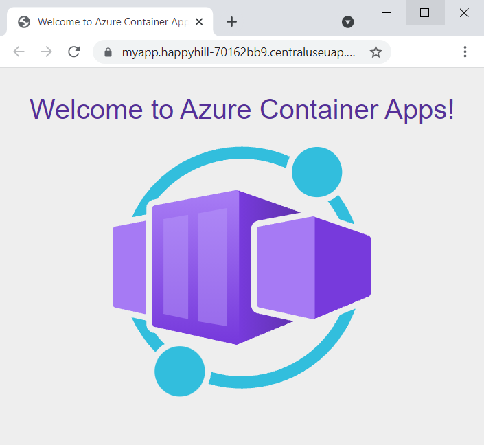

## 01. Wdróż aplikację

Załaduj zmienne środowiskowe.

```bash
set -a
source .env
set +a
```

Za pomocą polecenia `containerapp create` należy wdrożyć obraz kontenera do Azure Container Apps.

```bash
az containerapp create \
  --name my-container-app \
  --resource-group $RESOURCE_GROUP \
  --environment $CONTAINERAPPS_ENVIRONMENT \
  --image mcr.microsoft.com/azuredocs/containerapps-helloworld:latest \
  --target-port 80 \
  --ingress 'external' \
  --query properties.configuration.ingress.fqdn
```

Ustawiając opcję `--ingress` na `external`, udostępniasz aplikację kontenerową do Internetu.

## 02. Zweryfikuj wdrożenie

Polecenie `create` zwróciło nazwę domeny dla aplikacji. Skopiuj ten adres do przeglądarki internetowej i zobacz czy odpowiada w następujący sposób:



## 03. Zobacz jakie opcje są dostępne dla Twojej wdroonej aplikacji w portalu Azure

Wejdź w [portal.azure.com](portal.azure.com) -> `Resource Group` -> `Twoja Resource Group` -> `my-container-app` (Container Apps) i sprawdź jakie są dostępne opcje.
