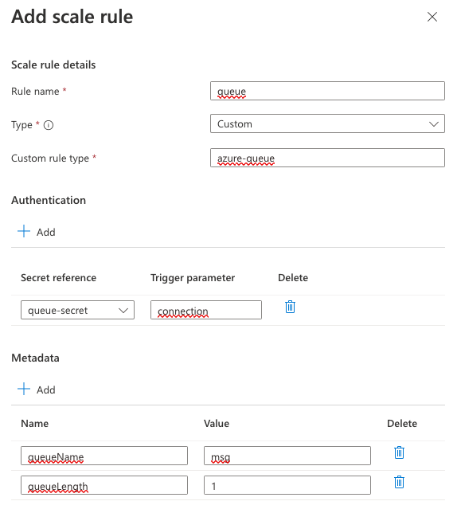

## 01. Utworz konto storage

Załaduj zmienne środowiskowe.

```bash
set -a
source .env
set +a
```

```bash
export AZURE_STORAGE_NAME=capps$(date +%s)
az storage account create --name $AZURE_STORAGE_NAME \
                          --resource-group $RESOURCE_GROUP 
```

```bash
export AZURE_STORAGE_CONNECTION_STRING=$(az storage account show-connection-string \
                                            -g $RESOURCE_GROUP \
                                            -n $AZURE_STORAGE_NAME \
                                            --query connectionString \
                                            -o tsv)
az storage queue create --name msg --account-name $AZURE_STORAGE_NAME
```

Za pomocą polecenia `containerapp create` należy wdrożyć obraz kontenera do Azure Container Apps.


```bash
az containerapp create \
  --name storage-processing \
  --resource-group $RESOURCE_GROUP \
  --environment $CONTAINERAPPS_ENVIRONMENT \
  --image docker.io/lukaszkaluzny/keda-demo:latest \
  --secrets queue-secret=$AZURE_STORAGE_CONNECTION_STRING \
  --env-vars queue=secretref:queue-secret
```

## 02. Zweryfikuj czy applikacja przetwarza wiadomości

```
az storage message put -q msg --content $(date | base64) --account-name $AZURE_STORAGE_NAME
LOG_ANALYTICS_WORKSPACE_CLIENT_ID=`az containerapp env show --name $CONTAINERAPPS_ENVIRONMENT --resource-group $RESOURCE_GROUP --query properties.appLogsConfiguration.logAnalyticsConfiguration.customerId --out tsv`
```

```
az monitor log-analytics query \
  --workspace $LOG_ANALYTICS_WORKSPACE_CLIENT_ID \
  --analytics-query "ContainerAppConsoleLogs_CL | where ContainerAppName_s == 'storage-processing' and Log_s contains 'processing' | project Log_s" \
  --out table --query [].Log_s
```

## 03. Zmodyfikuj skalowanie w portalu razem z prowadzącym

| Nazwa 	| Parametr 	|
|---	|---	|
| Rule name 	| queue 	|
| Type 	| Custom 	|
| Custom rule type 	| azure-queue 	|
| queueName 	| msg 	|
| queueLength 	| 1 	|
| queue-secret 	| connection 	|



## 04. Uruchom generowanie wiadomości

```bash
./msg.sh
```
